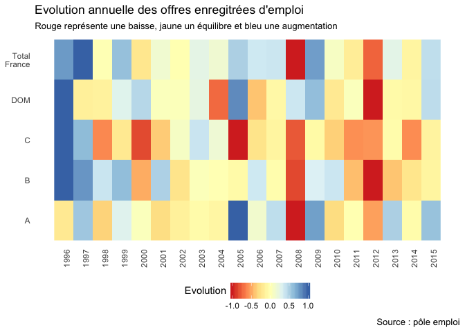

# PoleEmploi

C'est une exploration du jeu de données de pôle emploi sur les offres d'emploi enregistrées en France et dans les DOM.
On voit que l'enregistrement d'offres suit les différentes crises économiques, et que toutes les catégories d'offres ne varient pas de la même façon années après années.

