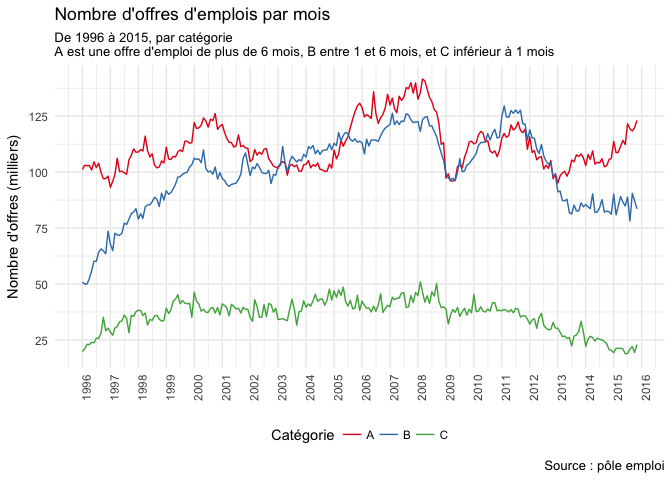
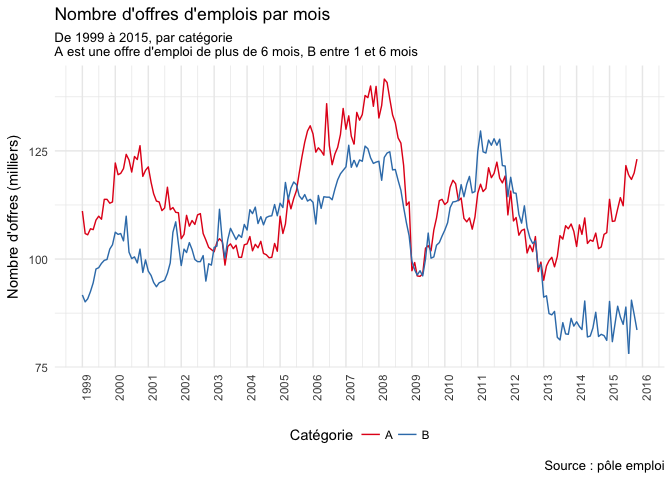
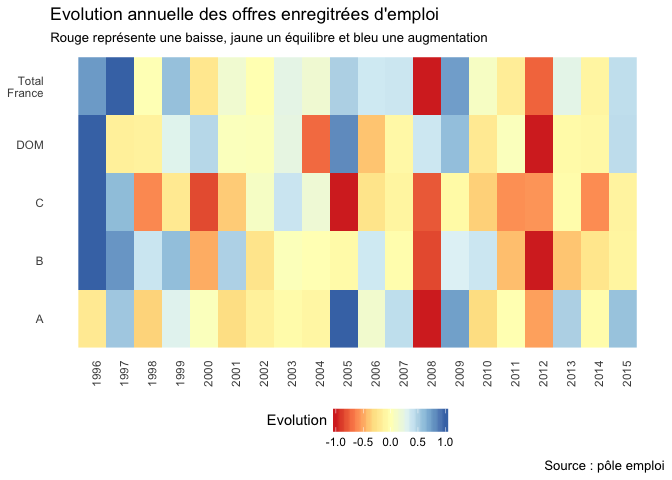

Analyse des données ouvertes de pôle emploi
================
Florian Gaudin-Delrieu
2017-01-19

Offres d'emploi
===============

Récupération des données
------------------------

Des données de pôle emploi sont accessibles en open data. En particulier, les données relatives aux offres d'emploi enregristrées sur pôle emploi sont [disponibles ici.](http://www.pole-emploi.org/informations/open-data-pole-emploi-@/25799/view-category-25799.html?)

Les données sont sous la forme d'un fichier excel avec 2 feuilles, dont une correspond à la description des variables. Pour pouvoir lire les données dans R, j'ai dû modifier dans OpenOffice le fichier et l'exporter au format csv (certaines cellules étaient fusionnées, et le formattage des nombres amenait des problèmes). Le fichier `offres.csv` fourni provient directement du fichier Excel. Les intitulés de colonnes ont été modifiés pour être plus facilement lisibles :

-   Periode (sans accent) ;
-   OEE\_A, OEE\_B et OEE\_C ( OEE signifie "Offres d'emploi enregistrées", pour les catégories A, B, et C) ;
-   Total\_France et Total\_DOM.
    Chargeons les libraries nécessaires

``` r
library(tidyverse)
```

    ## Loading tidyverse: ggplot2
    ## Loading tidyverse: tibble
    ## Loading tidyverse: tidyr
    ## Loading tidyverse: readr
    ## Loading tidyverse: purrr
    ## Loading tidyverse: dplyr

    ## Conflicts with tidy packages ----------------------------------------------

    ## filter(): dplyr, stats
    ## lag():    dplyr, stats

``` r
library(lubridate)    # Pour la gestion des dates
```

    ## 
    ## Attaching package: 'lubridate'

    ## The following object is masked from 'package:base':
    ## 
    ##     date

``` r
library(broom)        # Pour la gestion "tidy" des modèles
library(RColorBrewer) # Pour les palettes des graphes
library(GGally)       # Pour la mise à l'échelle (rescale11)
```

    ## 
    ## Attaching package: 'GGally'

    ## The following object is masked from 'package:dplyr':
    ## 
    ##     nasa

``` r
options("scipen"=10, digits = 5) # pour ne pas avoir trop de notation scientifique
```

Grâce à `readr::read_csv2` les colonnes ont directement le bon format (date et numérique), et sont sous forme de tibble.

``` r
offres <- read_csv2("offres.csv")
```

    ## Parsed with column specification:
    ## cols(
    ##   Periode = col_date(format = ""),
    ##   OEE_A = col_integer(),
    ##   OEE_B = col_integer(),
    ##   OEE_C = col_integer(),
    ##   Total_France = col_integer(),
    ##   Total_DOM = col_integer()
    ## )

Nettoyage des données
---------------------

Regardons les données

``` r
offres  # Le tibble gère l'affichage pour ne pas remplir la console
```

    ## # A tibble: 240 × 6
    ##       Periode  OEE_A OEE_B OEE_C Total_France Total_DOM
    ##        <date>  <int> <int> <int>        <int>     <int>
    ## 1  1996-01-01 101200 50800 19800       171800      3900
    ## 2  1996-02-01 103100 50000 21100       174200      4300
    ## 3  1996-03-01 102800 49900 23000       175700      5500
    ## 4  1996-04-01 103000 52400 22900       178300      5100
    ## 5  1996-05-01 100900 55900 23900       180700      4800
    ## 6  1996-06-01 104600 60200 23700       188500      4900
    ## 7  1996-07-01 102000 60100 25800       187900      5200
    ## 8  1996-08-01 104000 64200 25700       193900      5600
    ## 9  1996-09-01  99800 65700 28100       193600      5100
    ## 10 1996-10-01  97100 64800 35100       197000      5200
    ## # ... with 230 more rows

``` r
summary(offres)
```

    ##     Periode               OEE_A            OEE_B            OEE_C      
    ##  Min.   :1996-01-01   Min.   : 93200   Min.   : 49900   Min.   :18800  
    ##  1st Qu.:2000-12-24   1st Qu.:103450   1st Qu.: 87750   1st Qu.:32450  
    ##  Median :2005-12-16   Median :109400   Median :102300   Median :37800  
    ##  Mean   :2005-12-15   Mean   :111849   Mean   :100356   Mean   :36017  
    ##  3rd Qu.:2010-12-08   3rd Qu.:118950   3rd Qu.:113650   3rd Qu.:40700  
    ##  Max.   :2015-12-01   Max.   :141600   Max.   :129600   Max.   :50900  
    ##                       NA's   :1        NA's   :1        NA's   :1      
    ##   Total_France      Total_DOM   
    ##  Min.   :171800   Min.   :3700  
    ##  1st Qu.:227100   1st Qu.:5000  
    ##  Median :249900   Median :5600  
    ##  Mean   :248221   Mean   :5598  
    ##  3rd Qu.:269900   3rd Qu.:6200  
    ##  Max.   :311500   Max.   :7900  
    ##  NA's   :1        NA's   :1

Nous voyons qu'il y a des données manquantes (NA), où sont-elles ?

``` r
offres[is.na(offres$OEE_A), ]
```

    ## # A tibble: 1 × 6
    ##      Periode OEE_A OEE_B OEE_C Total_France Total_DOM
    ##       <date> <int> <int> <int>        <int>     <int>
    ## 1 2015-12-01    NA    NA    NA           NA        NA

Elles sont sur la même ligne, décembre 2015 et correspondent à des données non encore disponibles, nous pouvons supprimer la ligne sereinement.

``` r
offres <- filter(offres, !is.na(OEE_A))
```

Passons maintenant le tibble sous forme longue, plus pratique pour les graphiques, à l'aide de `tidyr::gather`.

``` r
offres_long <- offres %>%
  gather(categorie, nombre, -Periode)
offres_long$categorie <- as.factor(offres_long$categorie)
glimpse(offres_long)
```

    ## Observations: 1,195
    ## Variables: 3
    ## $ Periode   <date> 1996-01-01, 1996-02-01, 1996-03-01, 1996-04-01, 199...
    ## $ categorie <fctr> OEE_A, OEE_A, OEE_A, OEE_A, OEE_A, OEE_A, OEE_A, OE...
    ## $ nombre    <int> 101200, 103100, 102800, 103000, 100900, 104600, 1020...

``` r
head(offres_long)
```

    ## # A tibble: 6 × 3
    ##      Periode categorie nombre
    ##       <date>    <fctr>  <int>
    ## 1 1996-01-01     OEE_A 101200
    ## 2 1996-02-01     OEE_A 103100
    ## 3 1996-03-01     OEE_A 102800
    ## 4 1996-04-01     OEE_A 103000
    ## 5 1996-05-01     OEE_A 100900
    ## 6 1996-06-01     OEE_A 104600

Séparons des jeux de données pour les offres par catégorie, et les offres totales. Nous transformons le nombre d'annonces en milliers d'annonces

``` r
offres_OEE <- offres_long %>%
  filter(substr(as.character(.$categorie), 1, 3) == "OEE") %>%
  droplevels() %>% 
  mutate(nombre = nombre / 1000)


offres_totales <- offres_long %>%
  filter(substr(as.character(.$categorie), 1, 3) == "Tot") %>%
  droplevels() %>% 
  mutate(nombre = nombre / 1000)
```

J'aime bien le thème minimal pour les graphes.

``` r
theme_set(theme_minimal())
```

Premières analyses
------------------

Regardons d'abord les données globales sur le périmètre France

``` r
ggplot(offres, aes(Periode, Total_France /1000)) +
  geom_line(color = "tomato") +
  labs(title = "Offres d'emplois en France métropolitaine",
       subtitle = "De 1996 à 2015",
       caption= "Source : pôle emploi",
       x = NULL,
       y = "Nombre d'offres d'emploi (en milliers)") +
  scale_x_date(date_breaks = "1 year", date_labels = "%Y") +
  theme(axis.text.x = element_text(angle = 90))
```


Il y a une croissance des offres jusqu'en 2000, puis une baisse jusqu'en 2003. Cela correspond à l'éclatement de la bulle internet, suivi du krach boursier des années 2001-2002. S'ensuit une phase de reprise jusqu'en 2008 et un effondrement très fort correspondant à la crise financière de 2008 (crise des subprimes). Une reprise s'opère dès 2009, jusqu'à mi 2011 où une nouvelle chute importante s'opère jusqu'en 2013. Cela correspond à la crise de la dette de la zone euro. Depuis une timide reprise semble apparaître.
Regardons maintenant les offres par catégorie. D'après la notice du fichier pôle emploi, voilà à quoi correspondent les catégories :

-   Catégorie A : offre d'emploi durable, pour des contrats de plus de 6 mois ;
-   Catégorie B : offre d'emploi temporaire, pour des contrats entre 1 et 6 mois ;
-   Catégorie C : offre d'emploi occasionnel, pour des contrats inférieurs à 1 mois.

``` r
ggplot(data = offres_OEE, aes(Periode, nombre, color = categorie)) +
  geom_line() +
  labs(
    title = "Nombre d'offres d'emplois par mois",
    subtitle = "De 1996 à 2015, par catégorie\nA est une offre d'emploi de plus de 6 mois, B entre 1 et 6 mois, et C inférieur à 1 mois",
    caption = "Source : pôle emploi",
    x = NULL,
    y = "Nombre d'offres (milliers)",
    color = "Catégorie"
  ) +
  scale_x_date(date_breaks = "1 year", date_labels = "%Y") +
  scale_color_brewer(palette = "Set1",
                     breaks = c("OEE_A", "OEE_B", "OEE_C"),
                     labels = LETTERS[1:3]) +
  scale_y_continuous(breaks = seq(0, 150, by = 25)) +
  theme(axis.text.x = element_text(angle = 90),
        legend.position = "bottom")
```



Nous voyons que les offres d'emplois occasionnels (C) représentent un volume bien moindre que les offres d'emplois dits temporaires ou durables. Ils semblent moins affectés par les variations décrites dans les tendances globales (crises de 2000-2002, 2008 et 2011). La tendance de ces offres est orientée à la baisse depuis 2008.
Si en 1996 les volumes d'offres entre les catégories A et B sont sensiblement différents (2 fois plus d'offres d'emploi de catégorie A que B), à partir des années 2000 les volumes sont du même ordre de grandeur. Les offres d'emploi de catégorie B dépassent même celles des catégories A en 2003, avec un chassé croisé depuis. Entre 2005 et 2008 les offres d'emploi de catégorie A progressent le plus, mais seront plus touchées par la crise de 2008. Les offres de catégorie B diminuent aussi assez fortement, et sont au même niveau début 2009. On constate sur les deux séries une reprise jusqu'à mi 2011, puis une baisse. La baisse est plus forte pour les emplois de catégorie B, et stagne depuis 2013, alors que les offres de catégorie A repartent à la hausse depuis 2013.

Regardons maintenant un peu plus précisément les offres des catégroies A et B depuis 1999 (pour que les offres soient sur une échelle comparable, après la progression forte entre 1996 et 1999 pour les catégories B).

``` r
ggplot(
  data = offres_OEE %>% filter(categorie %in% c("OEE_A", "OEE_B"),
                               year(Periode) >= 1999),
  aes(Periode, nombre, color = categorie)
) +
  geom_line() +
  labs(
    title = "Nombre d'offres d'emplois par mois",
    subtitle = "De 1999 à 2015, par catégorie\nA est une offre d'emploi de plus de 6 mois, B entre 1 et 6 mois",
    caption = "Source : pôle emploi",
    x = NULL,
    y = "Nombre d'offres (milliers)",
    color = "Catégorie"
  ) +
  scale_x_date(date_breaks = "1 year", date_labels = "%Y") +
  scale_color_brewer(palette = "Set1",
                     breaks = c("OEE_A", "OEE_B", "OEE_C"),
                     labels = LETTERS[1:3]) +
  scale_y_continuous(breaks = seq(0, 150, by = 25)) +
  theme(axis.text.x = element_text(angle = 90),
        legend.position = "bottom")
```



Nous voyons mieux les variations, les catégories A subissent plus fortement la crise de 2008, mais récupèrent mieux depuis 2013. Les catégories B quant à elles stagnent depuis 2013, avec une variabilité qui augmente.

Modélisation des OEE
--------------------

Y a-t-il la même tendance, année par année pour toutes les catégories ? Et quelles sont les années/catégories qui se distinguent des autres ?
Pour cela, nous allons créer des régressions linéaires pour chaque année et chaque catégorie. Cela nécessitera d'utiliser :

1.  Créer une variable annee
2.  `tidyr::nest` pour créer un tibble avec colonnes de listes, pour regrouper les données autres que annee et catégorie ;
3.  `purrr::map` pour appliquer la régression linéaire `lm` pour chaque année et catégorie ;
4.  encore `purrr::map` pour appliquer `broom::tidy` qui met sous forme de tibble chaque modèle (mais toujours dans une colonne de listes) ;
5.  et enfin `tidyr::unnest` pour remettre le modèle sous forme de tibble.

``` r
offres_modeles <- offres_long %>%
  mutate(annee = year(Periode)) %>%
  nest(-annee, -categorie) %>% 
  mutate(models = map(data, ~ lm(nombre ~ Periode, data = .))) %>%
  mutate(tidied = map(models, tidy)) %>%
  unnest(tidied)

offres_modeles
```

    ## # A tibble: 200 × 7
    ##    categorie annee        term     estimate  std.error statistic
    ##       <fctr> <dbl>       <chr>        <dbl>      <dbl>     <dbl>
    ## 1      OEE_A  1996 (Intercept)  252267.8531 54046.8568    4.6676
    ## 2      OEE_A  1996     Periode     -15.6383     5.5927   -2.7962
    ## 3      OEE_A  1997 (Intercept) -306882.0944 87341.8172   -3.5136
    ## 4      OEE_A  1997     Periode      40.7886     8.7089    4.6836
    ## 5      OEE_A  1998 (Intercept)  392750.1786 83789.2612    4.6874
    ## 6      OEE_A  1998     Periode     -27.4803     8.0613   -3.4089
    ## 7      OEE_A  1999 (Intercept) -120350.7296 62701.5066   -1.9194
    ## 8      OEE_A  1999     Periode      21.3971     5.8278    3.6715
    ## 9      OEE_A  2000 (Intercept)   85403.9729 69620.1968    1.2267
    ## 10     OEE_A  2000     Periode       3.2755     6.2581    0.5234
    ## # ... with 190 more rows, and 1 more variables: p.value <dbl>

Ce qui nous intéresse ici est le coefficient de la régression (ce qui est dans la colonne term et avec la valeur `Periode`) pour savoir quelle est la tendance (positive, négative, plus ou moins importante)

``` r
tendances <- offres_modeles  %>% 
  filter(term == "Periode") %>% 
  select(annee, categorie, tendance = estimate)
```

Comme toutes les courbes ne sont pas sur les mêmes échelles de valeurs, nous allons les remettre à l'échelle entre -1 et 1 pour chaque catégorie avec la fonction `GGally::rescale11`.

``` r
tendance_echelle <- tendances %>% 
  group_by(categorie) %>% 
  mutate(tendance = rescale11(tendance))
```

Nous pouvons maintenant faire une "heatmap" pour voir ces évolutions par année et par catégorie.

``` r
ggplot(tendance_echelle, 
       aes(y = categorie, x = annee, fill = tendance)) +
  geom_raster() +
  scale_fill_gradientn(colors = brewer.pal(7, "RdYlBu"))+
  scale_x_continuous(breaks = 1996:2015, labels = 1996:2015) +
  scale_y_discrete(breaks = levels(tendance_echelle$categorie),
                   labels = c("A", "B", "C", "DOM", "Total\nFrance"))+
  theme(panel.grid.major = element_blank(),
        panel.grid.minor = element_blank(),
        legend.position = "bottom",
        axis.text.x = element_text(angle = 90)) +
  labs(x = NULL,
       y = NULL,
       fill = "Evolution\n",
       title = "Evolution annuelle des offres enregitrées d'emploi",
       subtitle = "Rouge représente une baisse, jaune un équilibre et bleu une augmentation",
       caption = "Source : pôle emploi")
```



Nous voyons que les catégories C sont en baisse continue (globalement) depuis 2005 où il y a eu la chute la plus importante.
Les catégories B ont subi leur plus forte chute en 2012, c'est la catégorie qui a le plus subi la crise de la zone euro.
La catégorie A a fortement reculé en 2008, et il y a un léger mieux depuis 2013. La variation des offres d'emploi enregistrées dans les DOM est assez différente de la variation des autres variables.

Conclusion
----------

A partir des offres d'emploi enregistrées, nous pouvons voir les différentes crises économiques. Les offres d'emploi inférieures à 1 mois sont peu importantes et diminuent depuis plusieurs années. Les offres d'emploi de plus de 6 mois sont en progression ces dernières années.
